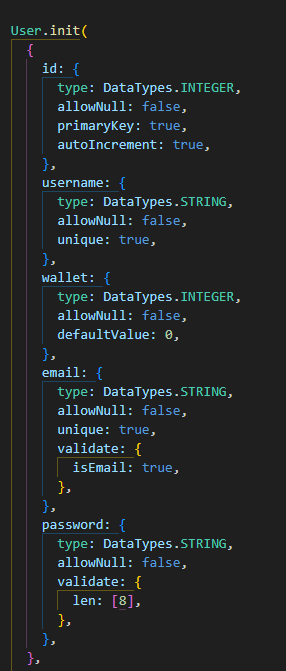
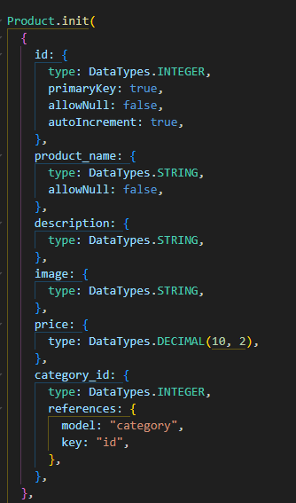
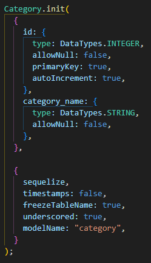
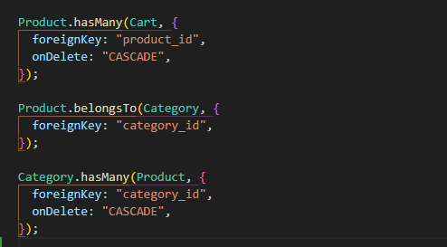

# cat-bucks

## Technology Used

| Technology Used |                                                    Resource URL                                                    |
| --------------- | :----------------------------------------------------------------------------------------------------------------: |
| JavaScript      | [https://developer.mozilla.org/en-US/docs/Web/JavaScript](https://developer.mozilla.org/en-US/docs/Web/JavaScript) |
| Nodejs          |                                   [https://nodejs.org/en](https://nodejs.org/en)                                   |
| MySQL           |                                   [https://www.mysql.com](https://www.mysql.com)                                   |
| introJs         |                                     [https://introjs.com](https://introjs.com)                                     |
| Handlebars      |                                [https://handlebarsjs.com](https://handlebarsjs.com)                                |

# User Stories

- As a user, I want to be able to create an account using the sign up page, so that I can have a unique account where my data is stored.

- As a user, I want to be able to log in and save my session. So that the website can remember my cart and cat bucks.

- As a user, I want to be able to purchase the items, and have them shipped to me. So that I can spend my cat bucks and receive my item.

- As a user, I want to be able to end my session and logout. So that the website will not have my data and my session will end.

## Description

A E-commerence site for cats and cat products that uses a virtual currency.

# Models

Model index

## Usage

first Sign up or login then press the button for money. Spend the currency on the cat products that you would like.

[Link to Video](https://youtu.be/Phq54MTPHeE)

## Learning Points

1. We learned a very easy to use and fun to implement introJs.

2. We are getting a better understanding of handlebars and how to link different files to them since they don't go by normal file paths.

## Author Info

Jarell Chinn

- [GitHub](https://github.com/Jarell-Chinn)

Theodore Okeke

- [Github](https://github.com/TheoUO)

Luke Harriman

- [Github](https://github.com/lth1013)

Jesus Reyes

- [Github](https://github.com/jesustgr)
